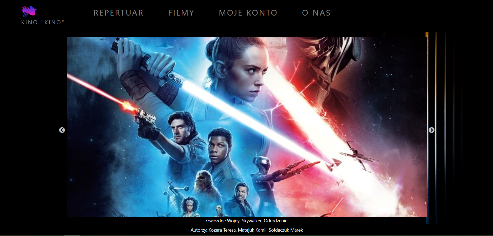
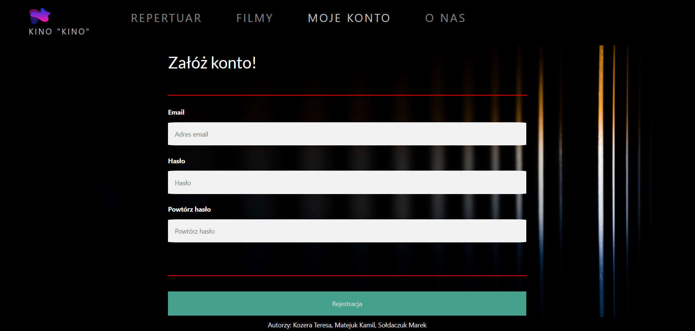

# Cinema Web App
 The third group project as part of the Coderscamp program.

<!-- TABLE OF CONTENTS -->
## Table of Contents

* [About the Project](#about-the-project)
  * [Built With](#built-with)
* [Getting Started](#getting-started)
  * [Prerequisites](#prerequisites)
  * [Installation](#installation)
* [Usage](#usage)
* [Authors](#authors)
* [License](#license)

<!-- ABOUT THE PROJECT -->
## About The Project

  Cinema Web App is a simple web app that was created as a team project for *CodersCamp 2019*.
  The project's aim was to learn the basics of React.js and make apps for each backend and frontend and to enable communication between them.


### Built With
The website was created with:
* [Node.js](https://nodejs.org)
* [mongoDB](https://www.mongodb.com/)
* [Bootstrap](https://getbootstrap.com)
* [Webpack](https://webpack.js.org/)
* [Babel](https://babeljs.io/)
* [React.js](https://reactjs.org/)

A REST API was made with Express.js in Node.js.
Finally we deployed both apps using [Heroku](https://heroku.com) and *mongoDB* database in the cloud. Obviously entire database has a wide data validation system. Moreover the app is adapted for future expansion.

<!-- GETTING STARTED -->
## Getting Started

To get a local copy up and running follow these simple steps.

### Prerequisites

* [Node.js](https://nodejs.org)

To check if you have Node.js installed, run this command in your terminal:
```sh
node -v
```

To confirm that you have npm installed you can run this command in your terminal:
```sh
npm -v
```

### Installation

1. Clone the repo
```sh
git clone https://github.com/MarekSoldaczuk/cinema-web-app.git
```
2. Configure backend from the `backend` folder
```sh
  npm i
  npm run build
  npm run dev
```
3. Set up the environment variables
```sh
  NODE_ENV:      production
  db:            database_connection_string
  jwtPrivateKey: mySecureKey
```
4. Configure frontend from the `frontend` folder
```sh
  npm i
  npm start
```
5. Try it yourself and have fun.


<!-- USAGE EXAMPLES -->
## Usage
The app is quite simple to use. After reaching the website _[https://google.com/](https://google.com/)_ what you'll see is the view presented as in the screenshot below.



The website looks like a typical cinema webstie. It offers you all the basic staff usefull while visiting any cinema. That's why you can easily check the repertoire, find any info about the movies or just buy a ticket for a specific screening. Moreover you can make an account and sign in whenever you want to access some additional content.



All the changes are set in the database so your data will never get lost.
However you can be assured about your data safety. 
All the sensitive data such as passwords are hashed in order make your account safe.
So after logging out you can get back anywhen you want.
Have fun organizing your free time in our cinema.

## Authors
* Kamil Matejuk - [KamilMatejuk](https://github.com/KamilMatejuk)
* Marek Sołdaczuk - [MarekSoldaczuk](https://github.com/MarekSoldaczuk)
* Teresa Kozera - [TeresaKozera](https://github.com/teresakozera)


<!-- LICENSE -->
## License
Distributed under the MIT License. See [LICENSE](https://choosealicense.com/licenses/mit/) for more information.


**Project Link**: [https://github.com/MarekSoldaczuk/cinema-web-app](https://github.com/MarekSoldaczuk/cinema-web-app)

